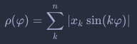
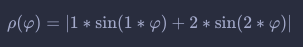
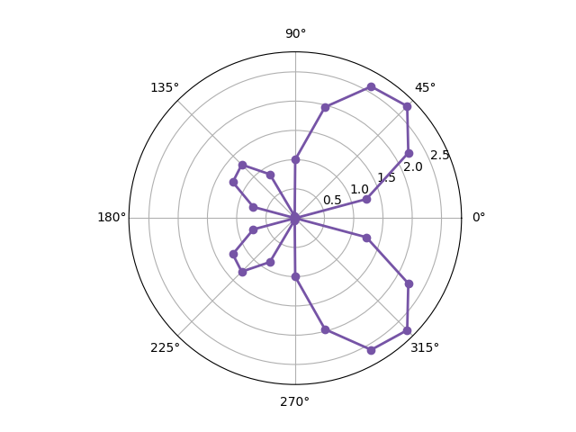
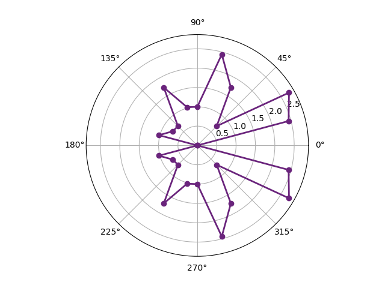

### ПР1 Инвариантные моменты
В этой работе существуют 2 треугольника, для которых программой высчитываются инвариантные моменты (всего 3 момента). Если геометрически эти треугольники равны, программа делает вывод, что это одна и та же фигура.

### ПР2 Метод дискременантной функции
Суть данного метода заключается в построении прямой, разделяющей два множества точек, с помощью математических преобразований.

### ПР3 Когнетивная графика
В этом методе строится уникальный образ в полярных координатах.

Играться можно с вот этой формула, для получение разного образа.<br>
Менять можно коэффициент k в данной формуле:



Практически эта формула применяется так:



В программе это выглядит так:
```python
np.around(abs(1 * np.sin(1 * np.radians(fi)) + 2 * np.sin(2 * np.radians(fi))), decimals=10)
```
Если указать шаг цикла (частоту точек) в 15 градусов, получится такая картина:



Если поменять коэффициенты при угле φ, можно получить другой образ<br>
В программе это выглядит так:

```python
np.around(abs(1 * np.sin(3 * np.radians(fi)) + 2 * np.sin(4 * np.radians(fi))), decimals=10)
```



Можно также менять коэффициенты x в степени k, и наблюдать удивительные образы :wink:

### Библиотеки
При работе понадобятся библиотеки:
* matplotlib
* numpy
* math
* random
